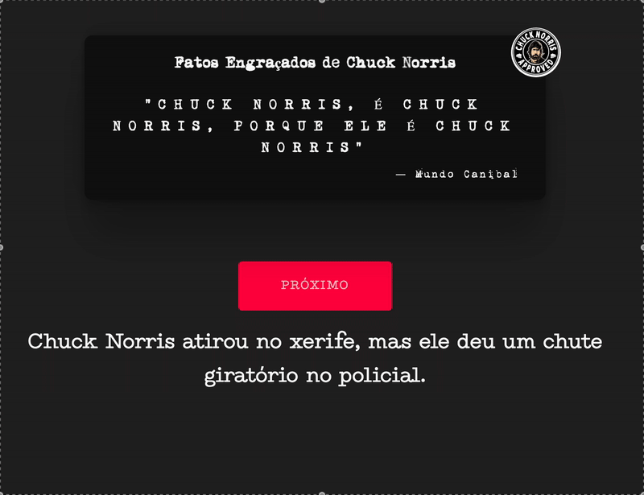

# Fatos Engraçados de Chuck Norris


## Sobre o Projeto

Este é um gerador de fatos engraçados sobre Chuck Norris, desenvolvido com HTML, CSS e JavaScript. O projeto utiliza a API pública [chucknorris.io](https://api.chucknorris.io/) para obter frases aleatórias e divertidas sobre o ícone dos memes.

## 🚀 Funcionalidades

- ✅ Geração de fatos aleatórios sobre Chuck Norris
- ✅ Interface responsiva para todos os dispositivos
- ✅ Animações e efeitos visuais modernos
- ✅ URLs amigáveis para melhor navegação
- ✅ Página de contato com formulário funcional
- ✅ Design moderno com CSS nativo (sem dependência de SCSS)
- ✅ Cache busting automático para atualizações
- ✅ SEO otimizado e acessibilidade aprimorada

## 🛠️ Tecnologias Utilizadas

- **HTML5** - Estrutura semântica moderna
- **CSS3 Nativo** - Estilização com variáveis CSS customizadas
- **JavaScript ES6+** - Funcionalidades interativas
- **jQuery 3.6.3** - Manipulação DOM e AJAX
- **Font Awesome 6.4.0** - Ícones modernos
- **API ChuckNorris.io** - Fonte dos fatos engraçados

## 📱 Como Usar

1. **Clone este repositório:**
   ```bash
   git clone https://github.com/ericfreitas88/fatos-de-chuck-norris.git
   ```

2. **Navegue até o diretório:**
   ```bash
   cd fatos-de-chuck-norris
   ```

3. **Abra o projeto:**
   - Abra o arquivo `index.html` em seu navegador, ou
   - Use um servidor local: `python3 -m http.server 8000`

4. **Navegue pelo site:**
   - Página principal: `/` ou `/index.html`
   - Página de contato: `/contato/`

## 🎯 Demonstração



**Acesse o projeto online:** [Fatos de Chuck Norris](https://ericfreitas88.github.io/fatos-de-chuck-norris/)

## 📁 Estrutura do Projeto

```
fatos-de-chuck-norris/
├── assets/                 # Imagens e recursos visuais
│   ├── chuck-icon.gif     # Favicon animado
│   ├── demo.gif           # Demonstração do projeto
│   ├── print-pagina.png   # Screenshot da página
│   └── selo-chuck.png     # Logo principal
├── contato/               # Página de contato (URL amigável)
│   └── index.html         # Formulário de contato
├── css/                   # Estilos CSS nativos
│   ├── estilo.css         # CSS principal consolidado
│   └── estilo.css.map     # Source map para debug
├── fontes/                # Fontes personalizadas
│   ├── 1942.ttf          # Fonte retrô
│   ├── Mom«t___.ttf      # Fonte decorativa
│   └── Type_Machine.ttf   # Fonte máquina de escrever
├── js/                    # Scripts JavaScript
│   ├── contato.js         # Funcionalidades da página de contato
│   ├── index.js           # Funcionalidades da página principal
│   └── jquery-3.6.3.min.js # Biblioteca jQuery
├── google98f2b3eef1c1f0d1.html # Verificação Google Search Console
├── index.html             # Página principal
└── README.md              # Documentação do projeto
```

## 🎨 Melhorias Implementadas

### **Design e UX**
- ✅ **CSS Nativo**: Migração completa de SCSS para CSS nativo
- ✅ **Variáveis CSS**: Sistema de cores e tipografia centralizado
- ✅ **Responsividade**: Layout adaptável para todos os dispositivos
- ✅ **Animações**: Efeitos suaves de hover e transições
- ✅ **Acessibilidade**: Melhor contraste e navegação por teclado

### **Performance e SEO**
- ✅ **Cache Busting**: Query strings automáticas para atualizações
- ✅ **URLs Amigáveis**: Estrutura `/contato/` em vez de `/contato.html`
- ✅ **Otimização**: CSS consolidado e minificado
- ✅ **Meta Tags**: SEO otimizado com descrições e palavras-chave

### **Funcionalidades**
- ✅ **API Integration**: Consumo eficiente da API ChuckNorris.io
- ✅ **Formulário de Contato**: Página dedicada para networking
- ✅ **Navegação**: Menu intuitivo entre páginas
- ✅ **Loading States**: Feedback visual durante carregamento

### **Desenvolvimento**
- ✅ **Código Limpo**: Estrutura organizada e comentada
- ✅ **Versionamento**: Controle de versão com Git
- ✅ **Deploy**: Hospedagem no GitHub Pages
- ✅ **Documentação**: README completo e atualizado

## 🔧 Configuração de Desenvolvimento

### **Pré-requisitos**
- Navegador moderno (Chrome, Firefox, Safari, Edge)
- Servidor local (opcional, mas recomendado)

### **Servidor Local**
```bash
# Python 3
python3 -m http.server 8000

# Node.js (se tiver instalado)
npx serve .

# PHP (se tiver instalado)
php -S localhost:8000
```

### **Estrutura de URLs**
- **Página Principal**: `http://localhost:8000/`
- **Página de Contato**: `http://localhost:8000/contato/`

## 🤝 Contribuição

Contribuições são bem-vindas! Para contribuir:

1. Fork o projeto
2. Crie uma branch para sua feature (`git checkout -b feature/AmazingFeature`)
3. Commit suas mudanças (`git commit -m 'Add some AmazingFeature'`)
4. Push para a branch (`git push origin feature/AmazingFeature`)
5. Abra um Pull Request

## 📞 Contato

**Eric Vilarino de Freitas**
- 🎯 Desenvolvedor Web Full Stack
- 🐙 [GitHub](https://github.com/ericfreitas88)
- 💼 [LinkedIn](https://www.linkedin.com/in/eric-vilarino-de-freitas-18920851/)
- 📧 [Email](mailto:ericfreitas88@gmail.com)

## 📄 Licença

Este projeto está sob a licença MIT. Veja o arquivo [LICENSE](LICENSE) para mais detalhes.

## 🙏 Agradecimentos

- [ChuckNorris.io](https://api.chucknorris.io/) pela API gratuita
- [Font Awesome](https://fontawesome.com/) pelos ícones
- Comunidade open source pelas inspirações

---

<div align="center">
  <strong>&copy; 2024 Eric Freitas - Todos os direitos reservados</strong>
  <br>
  <em>Feito com ❤️ e muito ☕</em>
</div>
